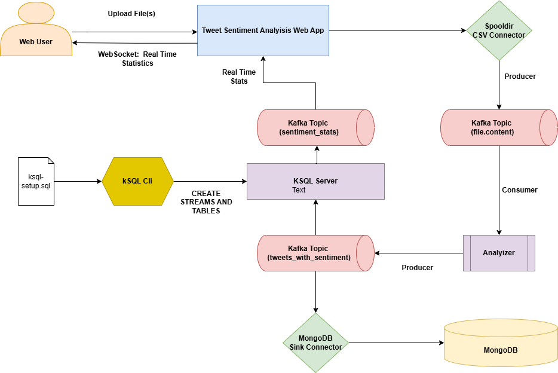

# Tweet Sentiment Analysis con Kafka

Esta aplicación es una plataforma completa de análisis de sentimiento de tweets en tiempo real. Utiliza Apache Kafka para la ingesta y procesamiento de datos de tweets, ksqlDB para la agregación y cálculo de estadísticas, y MongoDB para el almacenamiento persistente de datos. El backend está desarrollado en Flask y maneja la lógica de la aplicación, mientras que el frontend está construido con Nginx y proporciona una interfaz de usuario interactiva para cargar y analizar tweets. Además, se incluye un servicio de análisis que procesa los datos para determinar el sentimiento de los tweets. La aplicación utiliza WebSockets para proporcionar actualizaciones en tiempo real sobre las estadísticas de sentimiento directamente en la interfaz de usuario. 

## Flujo de la aplicación:

Desde el frontend se cargan los ficheros de tweets con esquema (id,link,content,date,retweets,favorites,mentions,hashtags,geo), y con el uso del conector SpoolDirCsvSourceConnector cada tweet se guarda en el topic de Kafka file.content. 

Los tweets de file.content son consumidos con un flujo de decodificación y clasificados con el uso de la librería TextBlob, en positivos, neutros o negativos, en función del valor de polaridad.

A través de un productor, los tweets con la información adicional de sentimiento se suben al topic tweets_with_sentiment, donde sucede lo siguiente:

1. Un conector sink de MongoDB, se encarga de guardar los tweets en la base de datos: tweet_analysis
2. Utilizando la el servicio KSQL Cli y KSQL Server, se crea un stream de datos y y vistas materializada de los datos que se sirve al front end como estadísticas en real time con una comunicación WebSocket gracias a la librería SocketIO y 
Fuente de Datos:

https://www.kaggle.com/datasets/austinreese/trump-tweets?select=trumptweets.csv

## Manual de Operaciones - ONE CLICK DEPLOYMENT

El archivo run.sh es un script de bash diseñado para automatizar el despliegue y configuración de los servicios necesarios para la aplicación de análisis de sentimientos de tweets en tiempo real. 

Descripción de la operativa de run.sh 

**1. Creación de Directorios:** 

Se crean directorios para almacenar los plugins de Kafka Connect: SpoolDir y MongoDB. 

Esto asegura que los conectores necesarios se descarguen y almacenen correctamente. 

**2. Descarga de Conectores:** 

Se descargan los conectores SpoolDir y MongoDB desde las URLs especificadas. 

La descarga se verifica para asegurar que se haya completado correctamente. 

**3. Descompresión y Verificación:** 

El conector SpoolDir se descomprime en su directorio correspondiente. 

Se verifica el contenido de los directorios de los conectores para asegurar que los archivos necesarios estén presentes. 

**4. Inicio de Servicios Docker:** 

Se inician varios servicios Docker en segundo plano: Zookeeper, broker de Kafka, Schema Registry, Kafka Connect, Control Center, ksqlDB server, ksqlDB CLI y las instancias de MongoDB. 

Estos servicios son esenciales para la ingesta, procesamiento y almacenamiento de datos. 

**5. Configuración de MongoDB ReplicaSet:** 

Se configura un ReplicaSet en MongoDB utilizando el primer nodo (mongo1). 

Esto es crucial para asegurar la alta disponibilidad y redundancia de los datos. 

**6 .Verificación de Kafka Connect:** 

El script espera hasta que Kafka Connect esté listo para recibir conexiones, realizando comprobaciones periódicas. 

Se reinicia Kafka Connect para asegurar que todos los conectores estén correctamente cargados. 

**7. Adición de Conectores de Kafka:** 

Se añaden los conectores SpoolDir y MongoDB a Kafka Connect mediante llamadas a la API REST de Kafka Connect. 

Esto permite la integración y movimiento de datos entre Kafka y otras fuentes/destinos de datos. 

**8 .Inicio de Servicios Restantes:** 

Se inician los servicios Docker restantes: el frontend (Nginx), el backend (Flask) y el analizador de tweets. 

Estos servicios completan la infraestructura necesaria para la aplicación. 

**9. Ejecución del Script de Configuración de ksqlDB:** 

Se ejecuta un script de configuración para ksqlDB desde el cliente CLI. 

Esto asegura que las consultas y configuraciones de ksqlDB estén preparadas para el procesamiento de datos en tiempo real. 

Crea el STREAM y la TABLA de KSQL desde el script ksql-setup.sql 

}}10. Reinicio de la aplicación de flask-backend:** 

Es necesario que las consultas de ksql estén creadas primero. 

 

Este enfoque automatizado garantiza que todos los componentes de la aplicación estén correctamente configurados y listos para operar, facilitando el despliegue y la administración de la plataforma de análisis de sentimientos de tweets. 

## Consultas KSQLDB:

El código para la creación de streams y tablas están en el fichero **ksql-setup.sql**. y la consulta para recibir el stream de los datos está definida en app.py utilizando la API de KSQL Server y SocketIO para hacer push en real time al front end.

## Diagrama de arquitectura de componentes

## Manual de Uso: 

El frontend está expuesto en http://localhost:80 donde podemos cargar ficheros csv (con el mismo esquema al definido al inicio), y donde visualizaremos el stream de tweets, con la clasificación, conteo de la clase de sentimiento a la que pertence el tweet y la media de polaridad de su clase.

## Servicios Utilizados:
 
**Zookeeper**:  Proporciona un servicio centralizado de coordinación para mantener la configuración y el estado de los clústeres de Kafka.
**Broker**: Broker de Kafka que gestiona la transmisión de mensajes en el clúster de Kafka.
**Schema-registry**: Almacena y gestiona los esquemas Avro utilizados en Kafka.
**Connect**: Proporciona capacidades de integración para conectores de Kafka para mover grandes cantidades de datos dentro y fuera de Kafka.
**Control-center**: Interfaz de usuario para monitorear y administrar el ecosistema de Confluent.
**Ksqldb-server**: Proporciona capacidades de procesamiento de flujos en tiempo real utilizando SQL sobre Kafka.
**Ksqldb-cli**: Cliente para acceso a KsqlDB Server. 
**Mongo1, mongo2, mongo3**: Base de datos NoSQL utilizada para almacenar datos persistentes. Configurado en modo replicado para alta disponibilidad.
**Frontend**: Servidor web Nginx utilizado para servir la aplicación frontend.
**Flask-backend**: Servidor backend desarrollado en Flask, que proporciona la lógica del servidor para la aplicación.
**Analyizer**:  Servicio que analiza los datos de los tweets.

